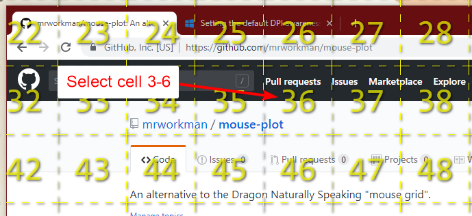
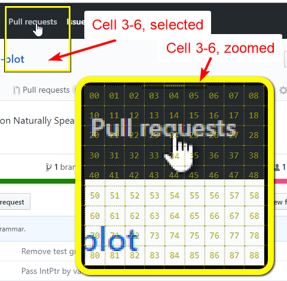

# Mouse Plot

**Mouse Plot** is an alternative to the [Dragon Naturally Speaking](https://www.nuance.com/dragon.html) (NatSpeak) "mouse grid".

For anyone who has used NatSpeak's mouse-grid control, it becomes obvious &ndash; very quickly &ndash; that it has a number of shortcomings, most notably:

 * the mouse grid closes when things like menus are opened (like the start menu/screen)
 * there can be a lot of steps just to click on what you're trying to click on. (e.g. "mouse grid, 3, 9, 5, 5, 7, click, dammit!")
 * doesn't work properly with multiple monitors

**MousePlot** tries to overcome these shortcomings, and it also tries to improve the expreience in genereal. At least, I found it to be better when I needed it! :D

## How it Works

 I'm working on it...

 

 Grid that splits the screen. Refer to cells by name, like `three six`, to position the mouse, and "select" the cell.

 

 Zooms for a closer view when a cell is selected. Gives fine-grained sub-cell selection. Refer to sub-cells by name, like `two four`, to position the mouse. Use commands like `up`, `down`, `left`, and `right` to move the mouse a pixel at a time. Use commands like `left 3` to move left by 3 pixels (for example).

 

## Status

This project is an offshoot of another in-progress project of mine: [Project Renfrew](https://github.com/mrworkman/Project-Renfrew) (which has its roots in [NatLink](https://qh.antenna.nl/unimacro/) code). Project Renfrew hass a *much* larger scope than MousePlot has alone, so I forked off MousePlot into its own projetc with the hopes that I can actually release it at some point soon!

## Compatability

Currently, I have only tested this project against NatSpeak 12. I do plan on testing it against 13, and 15 in the near future. It may continue to work on  13, but [from what I've read](http://handsfreecoding.org/2018/02/24/dragon-15-now-works-with-natlink-and-dragonfly/) there may be compatibility issues with 15 (This project is based on the code from [NatLink](https://qh.antenna.nl/unimacro/), so it currently has the same limitations).

### Can I use MousePlot at the same time as NatLink?

Yes, MousePlot can be installed alongside NatLink. As long as none of your NatLink grammars use "plot" as a command, then you should not have any issues!

## Some Background

Several years ago, I developed a chronic pain condition in both of my arms which made it impossible to use the computer, and thus, do my job. Without the help of a number of tools, I would not have been able to continue to work!

One of these tools, which was an absolute lifesaver for me, was [NatLink / Unimacro](https://qh.antenna.nl/unimacro/) (maintained by Quintijn Hoogenboom). NatSpeak, on its own, really sucks for writing code by voice, and some actions are downright maddening. NatLink helped save *a lot* of frustration. 

As someone who was unable to lift his arms out of his lap, let alone use a mouse, I was dependent on software (i.e. NatSpeak) to do my pointing and clickling. And unfortunately, NatLink did not provide a good solution to this problem.

NatLink allowed me to write a utility to work as a replacement for NatSpeak's mouse grid control using a combination of Python (for responding to voice commands), and C# (for front-end GUI work). This worked really well, and I wanted to share it but it was such a pain in the ass to set up, was buggy (but within my own tolerances), and kind of a mess internally.

*Happily, I have since regained the use of my arms*, but I wanted to work on a replacement for my old MousePlot implementation that I could share with others, and that would be **easy** for people  to install and set up!

